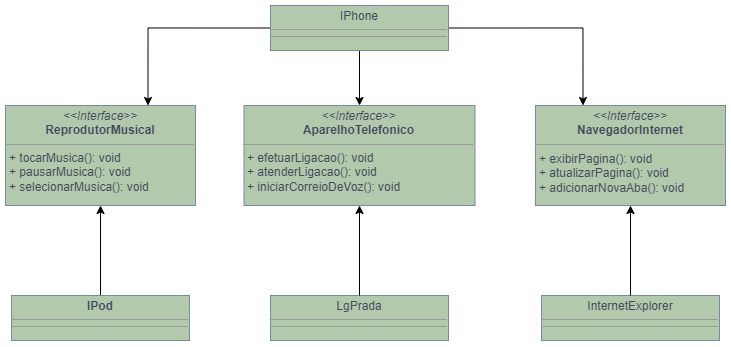

# Orientação a Objetos e UML: Diagramação de Classes do iPhone

O diagrama de classes abaixo foi elaborado como proposta ao "DESAFIO DE PROJETO" do programa **Santander Bootcamp 2023 - Fullstack Java+Angular**, da plataforma [DIO](https://www.dio.me).

O desafio consiste na representação de algumas das funcionalidades do primeiro IPhone, lançado no ano de 2007.

As funcionalidades representadas no diagrama são:

- Reprodutor Musical;
- Aparelho Telefônico;
- Navegador na Internet.

## Classes e Interfaces em JAVA

Na pasta __src__, organizadas em __pacotes__, estão as classes e interfaces na linguagem JAVA e, na  raiz, a classe __Usuario.java__ é a responsável por executar as funcionalidades.

Diagrama criado com [draw.io](https://app.diagrams.net).